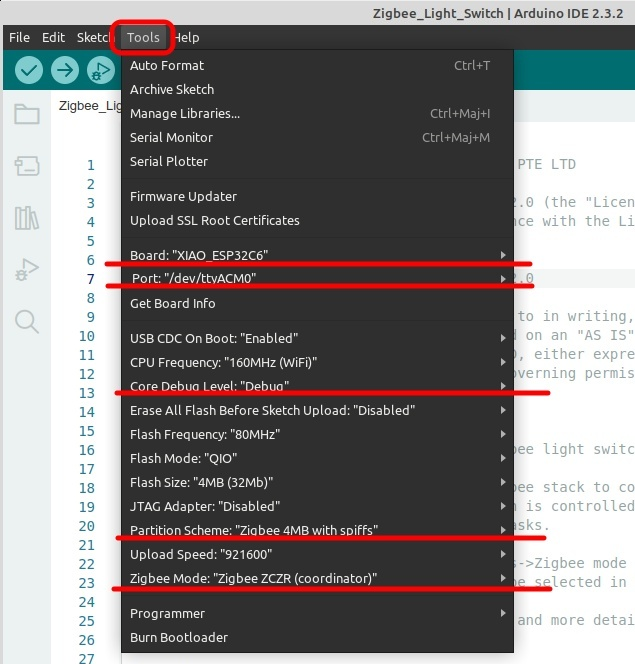

# 08-zigbee-switch

The `Zigbee_Light_Switch` directory contains a clone of the example sketch from the `esp32` version 3.0.2 package which is found here in a Linux system:
`~/.arduino15/packages/esp32/hardware/esp32/3.0.2/libraries/ESP32/examples/Zigbee/Zigbee_Light_Switch`

No modifications were made to the source code.

Do not forget to set the Arduino configuration as instructed in the sketch [README.md](Zigbee_Light_Switch/README.md) file before compiling. Here are the settings used with a XIAO ESP32C6.

With these settings, a XIAO ESP32-C6 running the unmodified Light Switch sketch, was paired with another XIAO ESP32-C6 running a modified Light Bulb sketch and the LED of the second XIAO could be controlled with the Boot button of the first XIAO.
