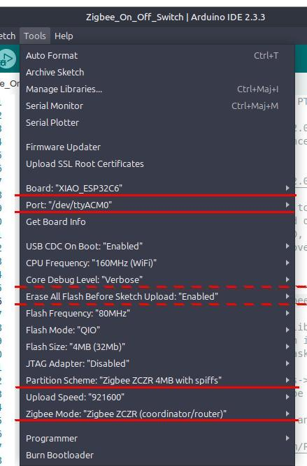

# 14_zigbee-on-off-switch

The `Zigbee_On_Off_Switch` directory contains a clone of the example sketch from the `esp32` board manager version 3.1.0-RC3.

No modifications were made to the source code.

## Usage

A XIAO ESP32-C6 running the unmodified `Zigbee_On_Off_Switch` sketch, was paired with
another XIAO ESP32-C6 running a modified `Zigbee_On_Off_Light` sketch. The LED of
this second XIAO could be controlled with the Boot button of the first XIAO.

Start the Switch XIAO and after it initialized the Zigbee stack, it will open a network for joining for 3 minutes. Start the Light XIAO and it should be able to join the network. Here is part of the Switch debug output as the Light joins its network

```
[ 12765][I][ZigbeeCore.cpp:213] esp_zb_app_signal_handler(): Opening network for joining for 180 seconds
[ 13232][I][ZigbeeCore.cpp:294] esp_zb_app_signal_handler(): Network(0xb96a) is open for 180 seconds
......................................................................................................................................................................[ 95807][V][ZigbeeCore.cpp:301] esp_zb_app_signal_handler(): ZDO signal: NWK Device Associated (0x12), status: ESP_OK
[ 95810][V][ZigbeeCore.cpp:301] esp_zb_app_signal_handler(): ZDO signal: ZDO Device Update (0x30), status: ESP_OK
[ 95829][I][ZigbeeCore.cpp:265] esp_zb_app_signal_handler(): New device commissioned or rejoined (short: 0x223c)
[ 95830][V][ZigbeeCore.cpp:269] esp_zb_app_signal_handler(): Device capabilities: 0x8c
[ 95851][D][ZigbeeSwitch.cpp:31] findCb(): Found light endpoint
[ 95852][I][ZigbeeSwitch.cpp:44] findCb(): Try to bind On/Off
[ 95855][I][ZigbeeSwitch.cpp:19] bindCb(): Bound successfully!
[ 95856][I][ZigbeeSwitch.cpp:22] bindCb(): The light originating from address(0x223c) on endpoint(10)
```

Once the Light has joined the network, the Boot button on the Switch XIAO can be used to toggle the LED on the Light XIAO.

If the Light can't seem to join, try restarting it by pressing the XIAO's boot button for 3 seconds to restart it.

## Compiling and uploading the firmware

### In the Arduino IDE

Add the following URL `https://espressif.github.io/arduino-esp32/package_esp32_dev_index.json`
in the **Additional boards manager URLs:** list in the IDE **Preferences** dialog.
Then, in the Boards Manager, update or install the latest version of **esp32** by Espressif Systems available.

Do not forget to set the Arduino configuration as instructed in the sketch
[README.md](Zigbee_On_Off_Switch/README.md) file before compiling. Here is a screen
capture of the settings used with a XIAO ESP32C6.




### In PlatformIO

Use the development version of the [pioarduino](https://github.com/pioarduino/platform-espressif32) fork
of the *official* `platform-espressif` repository. The correct Zigbee mode and partition scheme need to be set also.

This is all taken care of in the [platformio.ini](platformio.ini) configuration file found in this directory. Just compile and upload the forward and then open the serial monitor to see the debug output.
