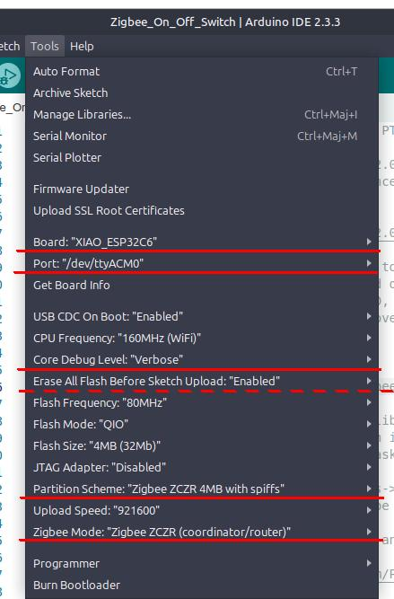

# Arduino-ESP32 Zigbee On/Off Switch Example

This example shows how to configure Zigbee Coordinator and use it as a Home Automation (HA) on/off light switch.

**The original README was renamed [README-org.md](README-org.md)**

## Supported Targets

Currently, this example supports the following targets.

| Supported Targets | ESP32-C6 | ESP32-H2 |
| ----------------- | -------- | -------- |

## Hardware Required

* A development board (ESP32-H2 or ESP32-C6 based) acting as a Zigbee end device (running the Zigbee_On_Off_Light example).

* Another development board (ESP32-H2 or ESP32-C6 based) acting as a Zigbee coordinator (running the Zigbee_On_Off_Switch example).

* 5 volt power supplies for the two boards and USB cables for power supply and programming.

## Configure the Project

Three macros are defined at the top of the source (main.cpp) to handle different development boards. These are
  1. GPIO_INPUT_IO_TOGGLE_SWITCH - number of the I/O pin to which a push button switch is connected. By default this is BOOT_PIN = 9 which is connected to the Boot button on the ESP32-H2 and the ESP32-C6.
  1. SERIAL_BAUD - usually 115200 if the development board has a discrete USB-to-serial adapter and not used otherwise.
  1. USE_EXTERNAL_ANTENNA - define only if the board is an XIAO ESP32C6 and only if an external antenna is used.

The macros are automatically defined correctly for the [Seeed Studio XIAO ESP32C6](https://www.seeedstudio.com/Seeed-Studio-XIAO-ESP32C6-p-5884.html) and should also be correct for the [Espressif Development Kits](https://www.espressif.com/en/products/devkits) although these have not been tested. It may be necessary to tweak some macros for other ESP32-C6 or ESP32-H2 based boards.

## Compiling and Uploading the Sketch

### Using Arduino IDE

Before Compile/Verify, go to the `Tools` menu to modify the following options.

* Select the correct **Board** (example: *"XIAO_ESP32C6"*).
* Select the correct **Port** (examples: *"/dev/ttyACM0"* in Linux, *"Com4"* in Windows).
* Set the **Partition Scheme** to *"Zigbee ZCZR 4MB with spiffs"*.
* Set the **Zigbee mode** *"Zigbee ZCZR (coordinator/router)"*.
* Optional: Set **Core Debug Level** to the desired level such as *"Verbose"* (default is *"None"*).
* Optional: Set **Erase All Flash Before Sketch Upload** to *"Enabled"* (default is *"Disabled"*).

### Using PlatformIO

*forthcoming*

## Connecting to a Zigbee Coordinator

Assuming that the Zigbee_On_Off_Light firmware was uploaded to the development board with **Erase All Flash Before Sketch Upload** set to *"Enabled"*, here are the steps to connect to a coordinator for the first time.

It is best to ensure that the development board running the Zigbee_On_Off_Switch coordinator firmware is very near to the ESP32 dev board running the Zigbee_On_Off_Light end device firmware. Tests have shown that another Zigbee coordinator or a Zigbee router a few metres away will not interfere.

- Power up the development board running the `Zigbee_On_Off_Light` sketch. 

- Power up the development board running the `Zigbee_On_Off_Switch` sketch. The `setup()` routine 

    - opens the network allowing end device to join for 180 seconds with the `Zigbee.setRebootOpenNetwork()` method,

    - starts Zigbee in coordinator mode,

    - enters a loop waiting for a light end device to connect.

After a short while, the end device (...Light) should have joined the Zigbee network created by the coordinator (...Switch). The serial output of the two devices should make that clear, especially if the **core debug level** was set to `"Verbose"`. In any case, test by pressing the boot button of the coordinator. It should toggle the state of the LED on the end device.
