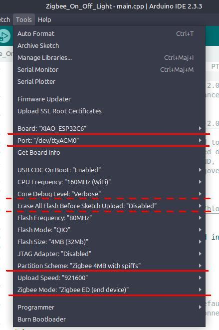
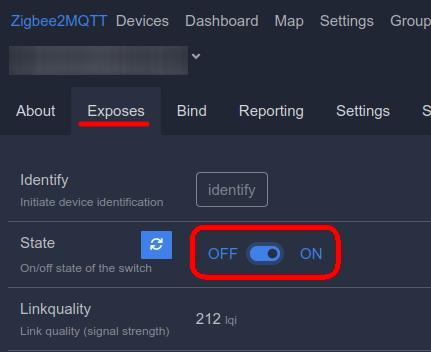

# 15_zigbee-on-off-light

The `Zigbee_On_Off_Light` directory contains basically a clone of the example sketch from the `esp32` board manager version 3.1.0-RC3.

However it was necessary to make slight adjustments to the code when using that sketch in conjunction with the `Zigbee_On_Off_Switch` sketch with two ESP32-C6 boards.

## Source Modifications

Neither of the two changes outlined below that are designed to support the XIAO ESP23C6 should impede using another ESP32-C6 based board instead.

### LED vs RGB_LED

Some modification of the source code was necessary to support the XIAO ESP32-C6 and other boards that have an onboard LED but not an RGB LED. Changes are easily identified because of the use of ```#if defined(RGB_BUILTIN)```.

```cpp
#if defined(RGB_BUILTIN)
  #define LED_PIN RGB_BUILTIN
#elif defined(LED_BUILTIN)
  #define LED_PIN LED_BUILTIN
  #define LED_ON LOW           // LOW = I/O pin must be grounded to turn on LED
#else
  #error "NO LED defined"
#endif
```

Note that on the XIAO the LED is turned on by writing LOW to its I/O pin. Set `#define LED_ON HIGH` for boards where setting the I/O pin high turns the LED on.

### Optional External Antenna

A macro has been added to signal that an external antenna is connected to the XIAO ESP32C6.

```cpp
#if defined(ARDUINO_XIAO_ESP32C6)
  // The onboard ceramic antenna is used by default.
  // Uncomment the following macro to use a connected external antenna.
  //#define USE_EXTERNAL_ANTENNA
#else
  #undef USE_EXTERNAL_ANTENNA
#endif               
```

The external antenna will be selected in the `setup()` function if `USE_EXTERNAL_ANTENNA` is defined.

## Compiling and uploading the firmware

### In the Arduino IDE

Add the following URL `https://espressif.github.io/arduino-esp32/package_esp32_dev_index.json`
in the **Additional boards manager URLs:** list in the IDE **Preferences** dialog.
Then, in the Boards Manager, update or install the latest version of **esp32** by Espressif Systems available.

Do not forget to set the Arduino configuration as instructed in the sketch
[README.md](Zigbee_On_Off_Light/README.md) file before compiling. Here is a screen
capture of the settings used with a XIAO ESP32C6.




### In PlatformIO

Use the development version of the [pioarduino](https://github.com/pioarduino/platform-espressif32) fork
of the *official* `platform-espressif` repository. The correct Zigbee mode and partition scheme need to be set also.

This is all taken care of in the [platformio.ini](platformio.ini) configuration file found in this directory. Just compile and upload the forward and then open the serial monitor to see the debug output.

## Zigbee2MQTT

Power up the XIAO ES32C6 with the `Zigbee_On_Off_Light` sketch but not the other XIAO with the `Zigbee_On_Off_Switch` sketch. Then log into the Zigbee2MQTT web interface. Enable join in the interface. After a short while, the XIAO should show up in the Devices table as Model `ZBlightBulb`, while the Manufacturer is listed as Unsupported.


Click on the Friendly name so see details about the Zigbee device.


Here the name of the *Manufacturer* is correctly reported. Click on the **Exposes** tab.



Clicking on the **OFF** and **ON** buttons in that view controls the LED of the XIAO ESP32C6.


## Usage

To control the LED on this device with the other XIAO running the `Zigbee_On_Off_Switch` firmware see [Zigbee_On_Off_Switch/Readme](../14_zigbee-on-off-switch/Readme.md) for details.
