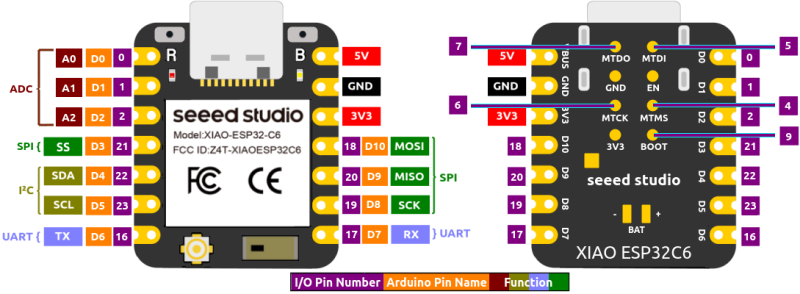
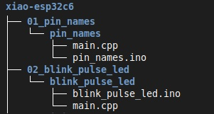

# XIAO ESP32C6 Sketches
**Arduino source code that accompanies [First Look at the Seeed Studio XIAO ESP32C6](https://sigmdel.ca/michel/ha/xiao/xiao_esp32c6_intro_en.html)**.

## Introduction

The XIAO ESP32C6 is a recent addition to the Seeed Studio XIAO series of diminutive development boards. It is based on the Espressif ESP32-C6 SoC which is the second Espressif microcontroller based on a RISC-V core.

## PlatformIO Notes

The current Espressif 32 [platform (version 6.7.0 dated May 14, 2024)](https://github.com/platformio/platform-espressif32/releases) in PlatformIO (PIO) is based on version 2.0.16 of the ESP32 Arduino core. Consequently it does not support the XIAO ESP32C6 (see [Add board support for Seeed XIAO ESP32C6](https://github.com/platformio/platform-espressif32/pull/1380#issuecomment-2205808510)). For that reason, these sketches cannot be compiled in PIO. Nevertheless the directory structure and file names are such that it will be easy to include PlatformIO when it takes on version 3.0 of the ESP32 Arduino core.

## Arduino IDE Notes

The latest version of the Arduino IDE can be obtained for Windows, Linux and macOS in the [Downloads](https://www.arduino.cc/en/software) page from Arduino.

Install the latest Espressif ESP32 Arduino core.

 1. Add https://espressif.github.io/arduino-esp32/package_esp32_index.json in the Additional Boards Manager URLS in the Preferences window in the IDE.
  
 1.  Install platform `esp32` by Espressif version 3.0.2 or newer with the Boards Manager

Select the `XIAO_ESP32C6` board in the `Tools` menu of the IDE when compiling a project.

Arduino sketches must have an `.ino` file name extension and must be contained in a directory that has the same name as the Arduino sketch (excluding the extension). Consequently the `01_pin_names` project contains a directory named `pin_names` that in turn contains the Arduino sketch `pin_names.ino`. That sketch is basically empty as it is a long comment only. This is not a problem because the Arduino IDE will import all source files found in the sketch directory. The actual code is in `main.cpp` which is the default name of a PlatformIO project.

 

## List of Projects      

| Project | NB |Purpose |
| ---     |:---:| --- |
| **01_pin_names** | 1,2 | Shows the content of `pins_arduino.h` |
| **02_blink_pulse_led** | 2 | Using `digitalRead`, `digitalWrite`, `analogWrite` (PWM) |
| **03_scan_wifi** | 2,3 | [WiFiScan](https://github.com/espressif/arduino-esp32/tree/master/libraries/WiFi/examples/WiFiScan) example from the esp32-arduino core |
| **04_wifi_blackhole** | 4 | Look at Wi-Fi station connect times |
| **05_wifi_tx_power** | 2,4 | Wi-Fi TX power vs connect time |
| **06_async_web_led**| 1,2,4,5 | Toggles the built-in LED on and off with a Web interface |
| **07_ble_led**| 1,2 | Toggles the built-in LED on and off with a Bluetooth LE app |
| **08_zigbee_switch**| 6 | Modified [Zigbee_Light_Switch](https://github.com/espressif/arduino-esp32/tree/master/libraries/ESP32/examples/Zigbee/Zigbee_Light_Switch) example from the esp32-arduino core |
| **09_zigbee_bulb**  | 6 | Modified [Zigbee_Light_Bulb](https://github.com/espressif/arduino-esp32/tree/master/libraries/ESP32/examples/Zigbee/Zigbee_Light_Bulb) example from the esp32-arduino core |
| **10_deep_sleep_tmr** | | Deep sleep with timed wake up |
| **10_deep_sleep_io** | 7 | Deep sleep with wake up on I/O event |

NB:
  1. Similar to sketch in [xiao_esp32c3_sketches](https://github.com/sigmdel/xiao_esp32c3_sketches)
  2. Similar to sketch in [supermini_esp32c3_sketches](https://github.com/sigmdel/supermini_esp32c3_sketches)
  3.  Released under the GNU LESSER GENERAL PUBLIC LICENSE.
  4.  Create a `secret.h` file with the correct Wi-Fi credentials using the `secrets.h.template` as a model. 
  5. Need to install two libraries. The details are in [libraries/README.md](libraries/README.md).
  6. Added support for some XIAO ESP32C6 features. Released under the Apache License, Version 2.0 .
  7. Requires an external pull up resistor.

### About `08_zigbee_switch` and `09_zigbee_bulb`: 

Flash the Zigbee_Light_Switch firmware on one XIAO ESP32C6 and the Zigbee_Light_Bulb firmware on a second XIAO ESP32C6. The boot button on the first board will toggle the yellow LED on/off on the second board. 

The Zigbee_Light_Bulb board will pair with a Zigbee2MQTT coordinator although it is not supported by the latter. It was necessary to use an external antenna to achieve the pairing, but it may not be the case in another situation.

### Further Details:

See [First Look at the Seeed Studio XIAO ESP32C6](https://sigmdel.ca/michel/ha/xiao/xiao_esp32c6_intro_en.html) for some details about these programs.

## Change Log

2024-07-18: Add board pinout

2024-07-09: Included use of the Serial peripheral in deep sleep examples

2024-07-08: Added deep sleep examples

2024-07-07: Added support for an external antenna (for XIAO ESP32C6) in Zigbee examples 

2024-07-01: Set LQI threshold only when LQI_THRESHOLD macro is defined in the  Zigbee Bulb example

2024-06-29: Improved ble_led

2024-06-28: Added ble_led sketch based on BLE libraries

2024-06-27: Added async web led sketch and `libraries` directory

2024-06-26: Added Zigbee Light Switch and Bulb sketches

2024-06-25: Updated after version 3.0.2 of `esp32` core released 

2024-06-24: Initial version

## License

Copyright 2024, Michel Deslierres. No rights reserved. 

While the copyright pertaining to included libraries must be respected, all the code by Michel Deslierres in this repository is in the public domain. In those jurisdictions where this may be a problem, the [BSD Zero Clause License](https://spdx.org/licenses/0BSD.html) applies.
