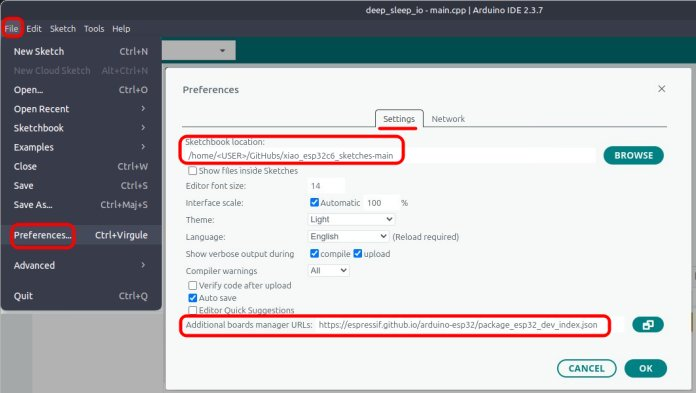
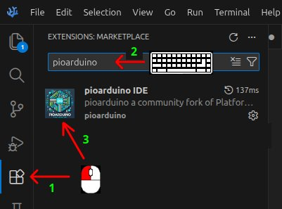

# XIAO ESP32C6 Sketches

*February 17, 2026*

**Arduino source code that accompanies [First Look at the Seeed Studio XIAO ESP32C6](https://sigmdel.ca/michel/ha/xiao/xiao_esp32c6_intro_en.html)**.

This repository has been updated to work with version 3.3.6 or newer of the ESP32 Arduino core. A release and tag were created to easily recover the original 2025-01-24 release using version 3.1.1 of the core *as if that could be of interest*. 

**Table of Contents**
<!-- TOC -->

- [1. Introduction](#1-introduction)
- [2. Development Environments](#2-development-environments)
  - [2.1. Arduino](#21-arduino)
  - [2.2. pioarduino](#22-pioarduino)
- [3. List of Projects](#3-list-of-projects)
  - [3.1. About `14_zigbee_on_off_switch` and `15_zigbee_on_off_light`](#31-about-14_zigbee_on_off_switch-and-15_zigbee_on_off_light)
  - [3.2. Further Details:](#32-further-details)
- [4. Change Log](#4-change-log)
- [5. License](#5-license)

<!-- /TOC -->


## 1. Introduction

The [XIAO ESP32C6](https://www.seeedstudio.com/Seeed-Studio-XIAO-ESP32C6-p-5884.html) was the eighth addition to the [Seeed Studio XIAO series](https://www.seeedstudio.com/xiao) of diminutive development boards. As its name makes clear, it is based on a SoC from the Espressif ESP32-C6 Series of microcontrollers. 


## 2. Development Environments

It should be possible to compile each project in the Arduino IDE or the pioarduino IDE with a minimum of fuss and without any need to install anything other than this repository. To accomplish this each Arduino sketch is contained in a PIO (PlatformIO or pioarduino) project.

 

Arduino sketches must have an `.ino` file name extension and must be contained in a directory with the same name as the Arduino sketch (excluding the extension). However, `pin_names.ino` is basically empty as it contains only comments and the actual code is in `main.cpp`. This is not a problem because the Arduino IDE will import all source files found in the same directory as the sketch. 

PIO, on the other hand, expects the `main.cpp` source in a directory named `src` alongside the project configuration file always named `platformio.ini`. Fortunately, the source directory can have another name, such as `pin_names`, if the latter is specified in the configuration file. 

### 2.1. Arduino 

The latest version of the Arduino IDE can be obtained for Windows, Linux and macOS in the [Downloads](https://www.arduino.cc/en/software) page from Arduino. Installing the latest Espressif ESP32 Arduino core is a two-step procedure.

 1. Add https://espressif.github.io/arduino-esp32/package_esp32_index.json in the Additional Boards Manager URLS in the Preferences window in the IDE.
  
 1. Using the Boards Manager (`Tools` / `Board` / `Boards Manager`), install platform `esp32` by Espressif, version 3.3.6 or newer. 

This is a one-time task. 

Many of the sketches are dependent on a library stored in the local `libraries` folder contained in this repository. That directory will be searched only if the sketchbook location in the IDE **Preferences** settings is the directory containing the downloaded repository. 
       
[](images/arduino_preferences_big.jpg)

 - Adjust the location to reflect the actual directory on the local machine.
 - Keep track of the old sketchbook location before changing it.  
 - Reset the sketchbook location to its old value when done with sketches in this repository.

When compiling a project, select the `XIAO_ESP32C6` board in the `Tools` menu of the IDE. The default values for the other options in the menu are acceptable except for the Zigbee sketches. See their respective README for details.


### 2.2. pioarduino 

While [PlatformIO](https://platformio.org/) is widely used, it is simpler to use the [pioarduino](https://github.com/pioarduino/pioarduino-vscode-ide) fork when working with recent ESP32 microcontrollers.

Unlike the Arduino IDE, pioarduino IDE is not a stand-alone application. It is an [extension](https://marketplace.visualstudio.com/items?itemName=pioarduino.pioarduino-ide) that is installed in the code editor [Visual Studio Code](https://code.visualstudio.com/) (VSCode), or [VSCodium](https://vscodium.com/). The latter is a less well-known fork of the former that claims to have removed telemetry/tracking from VSCode. So far, it does not contain the AI additions to VSCode. 

The pioarduino IDE extension is available in the extension marketplace of both code editors. Consequently, its installation is a simple three-step procedure. 



This is a one-time task.

All configuration settings of a project are specified in a `platformio.ini` file contained in the root directory of the project. Since these are included in the repository, there is usually nothing to do. Here is an example configuration file.

```ini
[platformio]

src_dir = scan_wifi    ; Arduino requirement: sketch source: ../scan_wifi/scan_wifi.ino
lib_dir = ../libraries ; relative to the directory containing this configuration file

[env:seeed_xiao_esp32c6]
platform = https://github.com/pioarduino/platform-espressif32/releases/download/stable/platform-espressif32.zip
board = seeed_xiao_esp32c6
framework = arduino
monitor_speed = 460800
;upload_port = /dev/ttyACM0
;monitor_port = /dev/ttyACM0    
```

The [pioarduino-espressif32](https://github.com/pioarduino/platform-espressif32) platform is used. Currently the version used is [pioarduino/platform-espressif Release 55.03.36 Arduino Release v3.3.6 based on ESP-IDF v5.5.2.260116](https://github.com/pioarduino/platform-espressif32/releases/tag/55.03.36) released on January 21, 2026. 

The IDE will automatically install the platform first time it is used. Because of that, the first compilation against a new platform takes considerably more time than subsequent compilations.

## 3. List of Projects      

| Project |Purpose |
| ---     | --- |
| **00_sys_info** | Prints information about the mcu, memory, firmware size and the antenna configuration |
| **01_pin_names** | Shows the content of `pins_arduino.h` and prints some defined macros |
| **02_blink_pulse_led** | Using `digitalRead`, `digitalWrite`, `analogWrite` (PWM) |
| **03_scan_wifi** | Modified [WiFiScan](https://github.com/espressif/arduino-esp32/blob/3.1.1/libraries/WiFi/examples/WiFiScan/WiFiScan.ino) example from older (3.1.1) esp32-arduino core |
| **04_wifi_connect_time** | Measure Wi-Fi connection times and signal strength |
| **05_wifi_tx_power** | Wi-Fi TX power vs connect time |
| **06_async_web_led**| Toggles the built-in LED on and off with a Web interface |
| **07_ble_led**| Toggles the built-in LED on and off with a Bluetooth LE app |
| ~~08_zigbee_switch~~|  | *use 14_zigbee_on_off_switch*  |
| ~~09_zigbee_bulb~~  |  | *use 15_zigbee_on_off_light* |
| **10_deep_sleep_tmr** | Deep sleep with timed wake up |
| **11_deep_sleep_io** | Deep sleep with wake up on I/O event |
| **12_xiao32c6_antenna** | Examines the I/O configuration for the antenna RF switch |
| **13_wifi_uptime** | Comparing Wi-Fi connectivity across boards|
| **14_zigbee_on_off_switch**| Modified [Zigbee_On_Off_Switch](https://github.com/espressif/arduino-esp32/tree/3.3.6/libraries/Zigbee/examples/Zigbee_On_Off_Switch) example from the esp32-arduino 3.3.6 core |
| **15_zigbee_on_off_light**  | Modified [Zigbee_On_Off_Light](https://github.com/espressif/arduino-esp32/tree/3.3.6/libraries/Zigbee/examples/Zigbee_On_Off_Light) example from the esp32-arduino 3.3.6 core |
| **16_MatterOnOffLight** | Modified [MatterOnOffLight]() example from the esp32-arduino 3.3.6 core |

Most of these projects will work with the newer XIAO ESP32C5 (see [xiao_esp32c5_sketches](https://github.com/sigmdel/xiao_esp32c5_sketches)) and the older XIAO ESP32C3 (see [xiao_esp32c3_sketches](https://github.com/sigmdel/xiao_esp32c3_sketches)). 

### 3.1. About `14_zigbee_on_off_switch` and `15_zigbee_on_off_light` 

These sketches replace the deprecated `08_zigbee_switch` and `09_zigbee_bulb` sketches respectively.

Flash the Zigbee_On_Off_Switch firmware on one XIAO ESP32C6 or XIAO ESP32C5 and the Zigbee_On_Off_Light firmware on a second XIAO ESP32C6 or XIAO ESP32C5. The boot button on the first board will toggle the yellow LED on/off on the second board. However, the Zigbee_On_Off_Light end device can be used with a single XIAO because it will connect to a Zigbee2MQTT coordinator and its on-board LED can be controlled from the coordinator's web interface. 

### 3.2. Further Details:

See [First Look at the Seeed Studio XIAO ESP32C6](https://sigmdel.ca/michel/ha/xiao/xiao_esp32c6_intro_en.html) for some details about these programs. 

## 4. Change Log


| Date | Change |
| :---  |  :--- |
| 2026-02-17 | Removed seeed_xiao_esp32c6.json board definition now included in ESP32 arduino core and added modified MatterOnOffLight example |
| 2026-02-16 | Update wifi_uptime, Zigbee_On_Off_Switch, Zigbee_On_Off_Light | 
| 2026-02-15 | Update ble_led, deep_sleep_tmr, deep_sleep_io, xiao32c6_antenna |
| 2026-02-11 | Added more build macros in pin_names.ino |
| 2026-02-07 | Update the configuration files and the 06_async_web_led |
| 2026-01-30 | Remove 04_wifi_blackhole and replace with 04_wifi_connect_time. Update 05_wifi_tx_power. Add pioarduino info |
| 2026-01-29 | Add MACs library. Update 03_scan_wifi |
| 2026-01-29 | Removed old zigbee examples, added 00_sys_info project, updated 01_pin_names, 02_blink_pulse_led, and this file |
| 2026-01-27 | Created v3.1.1_2025-01-24 tag and release |
| 2025-01-24 | Confirmed that Zigbee_On_Off_Switch and Zigbee_On_Off_Light can be compiled with the most recent version of pioarduino in PlatformIO |
| 2025-01-23 | Update Zigbee_On_Off_Switch and Zigbee_On_Off_Light using the ESP32 version 3.1.1 Zigbee examples |
| 2025-01-06 | Update about latest Zigbee problem | 
| 2024-11-23 | Add new Zigbee examples |
| 2024-11-06 | PlatformIO support |
| 2024-08-12 | Added Wi-Fi uptime test |
| 2024-08-09 | Corrected and completed RF switch and antenna selection fix |
| 2024-08-09 | Made the project self-contained by adding private copies of required libraries |
| 2024-08-06 | Fixed RF switch enable and antenna selection for ESP32 Arduino 3.0.2 and up|
| 2024-08-05 | Investigation of I/O ports controlling the antenna RF switch|
| 2024-08-04 | New pin definitions added in ESP32 Arduino 3.0.4|
| 2024-07-18 | Add board pinout|
| 2024-07-09 | Included use of the Serial peripheral in deep sleep examples|
| 2024-07-08 | Added deep sleep examples|
| 2024-07-07 | Added support for an external antenna (for XIAO ESP32C6) in Zigbee examples |
| 2024-07-01 | Set LQI threshold only when LQI_THRESHOLD macro is defined in the  Zigbee Bulb example|
| 2024-06-29 | Improved ble_led|
| 2024-06-28 | Added ble_led sketch based on BLE libraries|
| 2024-06-27 | Added async web led sketch and `libraries` directory|
| 2024-06-26 | Added Zigbee Light Switch and Bulb sketches|
| 2024-06-25 | Updated after version 3.0.2 of `esp32` core released |
| 2024-06-24 | Initial version |

## 5. License

Copyright 2024-2026 Michel Deslierres. No rights reserved. 

While the copyright pertaining to included libraries must be respected, all the code by Michel Deslierres in this repository is in the public domain. In those jurisdictions where this may be a problem, the [BSD Zero Clause License](https://spdx.org/licenses/0BSD.html) applies.
