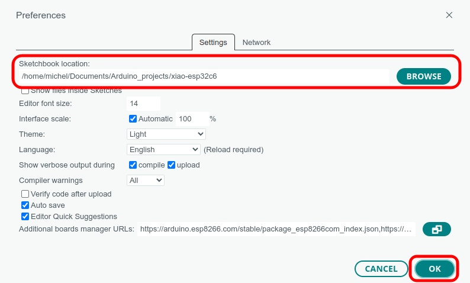
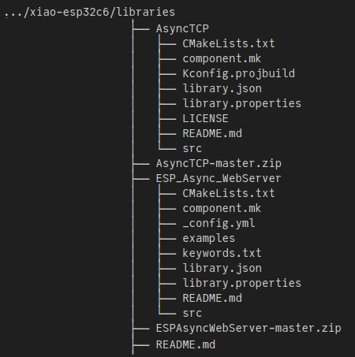

# Additional Libraries

## 06_async_web_led

The `async_web_led` sketch is dependant on two libraries

  1. AsyncTCP 
  2. ESPAsyncWebServer

Unfortunately, the Arduino Library Manager does not provide ESP32-C6 compatible versions. It will be necessary to download versions from JDavid (blackhack) and install these. To obtain them, click on the link to each of the GitHub respositories

  1. https://github.com/blackhack/AsyncTCP
  2. https://github.com/blackhack/ESPAsyncWebServer

In each case, click on the ``[Code]`` button and then on the `Download ZIP` button
and save the downloaded archive in the `libraries` directory along side of this `README.md` file.

Install the libraries using the Arduino IDE.

  1. Open the `async_web_led` sketch in the IDE.

  2. Go to the Preferences window of the IDE: **File » Preferences**
xiao_esp32c6_sketches (github)% 
  3. Enter the directory containing `06_async_web_led` directory in  `Sketchbok location:`   
  It would be a good to jot down the previous sketchbook location beforehand in order to restore it when done with the example sketch.

  4. Click on the `OK` button.

  5. For each of the libraries starting with `AsyncTCP-master.zip` install the library manually:   
     **Sketch » Include library... »  Add .ZIP library...**   
  
